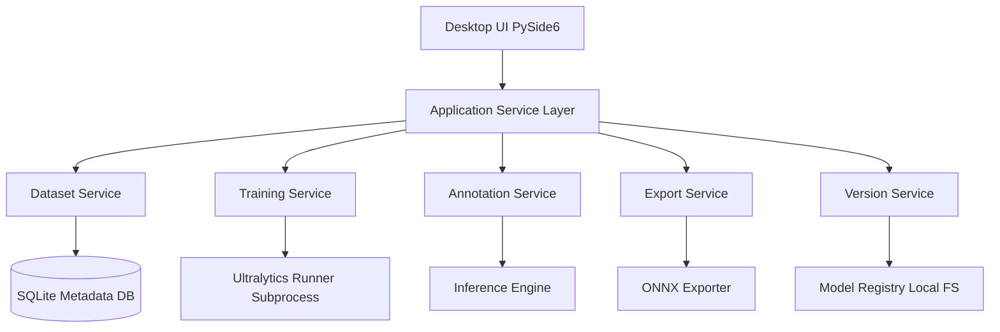

# YOLO Desktop Studio Design

Feature Name: yolo-studio-desktop
Updated: 2026-05-09

## Description

本设计实现一个 Windows 优先、纯离线、绿色免安装的工业缺陷检测桌面工具。核心能力覆盖数据导入、训练配置、模型版本管理、辅助标注与模型导出，并为后续 OBB 与多任务扩展保留架构空间。

## Technology Selection

最终选型：`Python + PySide6 + QML(Optional) + Ultralytics + ONNX 导出 + SQLite`

选型原因：

1. 与训练生态一致，工程复杂度最低。
2. GPU 训练链路最直接，调试与问题定位成本最低。
3. 打包可行性高，可通过 PyInstaller/Nuitka 构建绿色包。
4. 后续接入标注编辑能力时，Python 图像与几何生态成熟。

对比方案：

1. Tauri + React + Python 后端
   - 优点: UI 现代、交互灵活。
   - 缺点: 双进程与 IPC 复杂、打包与 GPU 依赖收敛更难、排障成本高。
2. Electron + Node
   - 优点: 前端团队上手快。
   - 缺点: 训练核心仍需 Python 侧，资源占用高，整体链路更重。
3. C++/Qt 原生
   - 优点: 性能与桌面能力强。
   - 缺点: 训练框架与工程效率不匹配，研发周期显著增加。

结论：针对你当前目标，Python 单栈方案在可交付速度、稳定性、维护成本上最优。

### YOLO v5 技术决策

最终决策：统一使用 Ultralytics 官方 `yolo` 接口管理 v5/v8/v8_obb/v10/v11。

对比：

1. 统一 Ultralytics 接口
   - 优点: 单一训练入口、参数与日志格式统一、维护成本最低。
   - 缺点: 少数 v5 历史参数行为可能与早期 yolov5 仓库存在细微差异。
2. v5 走独立 yolov5 仓库
   - 优点: 与历史 v5 行为更贴近。
   - 缺点: 需要维护双训练管线，参数映射与兼容测试成本高。

采用理由：你当前目标是降低复杂度并减少出错，统一接口收益明显大于行为差异风险。

## Architecture



架构说明：

1. UI 与训练执行解耦，训练跑在子进程，避免界面阻塞与闪退连带。
2. 元数据存 SQLite，模型与数据实体文件存本地文件系统。
3. 训练与导出统一通过任务执行器调度，便于后续加入队列、优先级与断点续训。

## Components and Interfaces

### 1. Dataset Service

职责：导入、校验、切分、索引。

接口：

```text
import_dataset(path: str, format: str="yolo_txt") -> DatasetImportResult
validate_dataset(dataset_id: str) -> ValidationReport
split_dataset(dataset_id: str, train_ratio: float, val_ratio: float) -> SplitResult
```

### 2. Training Service

职责：构建训练配置、启动/停止训练、消费日志、写入指标。

接口：

```text
create_train_job(req: TrainJobCreateRequest) -> TrainJob
start_train_job(job_id: str) -> None
stop_train_job(job_id: str) -> None
get_train_job_status(job_id: str) -> TrainJobStatus
```

### 3. Version Service

职责：模型版本建档、父子版本关系、增量训练来源。

接口：

```text
create_model_version(job_id: str) -> ModelVersion
list_model_versions(project_id: str) -> list[ModelVersion]
link_parent_version(version_id: str, parent_version_id: str) -> None
```

### 4. Annotation Service

职责：辅助标注推理、阈值筛选、批量确认、手工编辑。

接口：

```text
run_assisted_annotation(req: AssistedAnnotationRequest) -> AssistedAnnotationBatch
apply_threshold(batch_id: str, conf_thres: float) -> AssistedAnnotationBatch
save_annotation_edit(sample_id: str, edits: list[BoxEdit]) -> None
bulk_confirm(sample_ids: list[str]) -> BulkConfirmResult
```

### 5. Export Service

职责：pt/onnx 导出与导出日志管理。

接口：

```text
export_model(req: ExportRequest) -> ExportTask
get_export_status(task_id: str) -> ExportStatus
```

## Data Models

```text
Project
- id: str
- name: str
- root_path: str
- created_at: datetime

Dataset
- id: str
- project_id: str
- image_dir: str
- label_dir: str
- format: str
- class_names: list[str]
- sample_count: int

TrainConfig
- model_family: enum[v5,v8,v8_obb,v10,v11]
- img_size: int
- batch: int
- epochs: int
- patience: int (default 50)
- device: str (cpu/cuda:0)
- workers: int
- pretrained_weights: str | null

TrainJob
- id: str
- project_id: str
- dataset_id: str
- config: TrainConfig
- status: enum[pending,running,succeeded,failed,stopped]
- metrics_json: str
- log_path: str

ModelVersion
- id: str
- project_id: str
- job_id: str
- parent_version_id: str | null
- best_pt_path: str
- created_at: datetime

AnnotationRecord
- id: str
- dataset_id: str
- image_path: str
- boxes_json: str
- source: enum[manual,assisted]
- confirmed: bool

ExportTask
- id: str
- version_id: str
- format: enum[pt,onnx]
- options_json: str
- status: enum[pending,running,succeeded,failed]
- output_path: str
```

## Correctness Properties

1. 每个 ModelVersion 必须关联唯一训练任务。
2. 任一 TrainJob 的配置快照不可变，避免复现实验失败。
3. 标注保存操作必须原子写入，禁止部分样本写入成功。
4. 导出产物路径必须落在项目目录内，避免误写系统目录。

## Error Handling

1. 数据集校验错误按样本粒度收集，不阻断整体导入。
2. 训练子进程异常退出时，主进程只更新任务状态为 failed。
3. 显存不足、模型不兼容、导出失败等错误提供可读原因与原始日志入口。
4. UI 侧所有阻塞操作均带超时与取消能力。

## Test Strategy

1. 单元测试
   - Dataset 解析与 YOLO txt 坐标转换
   - TrainConfig 合法性校验
   - 标注编辑增删改逻辑
2. 集成测试
   - 从导入到训练到导出的完整 happy path
   - 历史权重增量训练流程
   - 辅助标注阈值筛选与批量确认流程
3. 稳定性测试
   - 100、1000、10000 张样本导入与浏览压力测试
   - 训练期间 UI 长时间可响应测试

## Version Plan

### MVP (V0.1)

1. 数据导入与 YOLO txt 校验
2. bbox 可视化与手工编辑（改框、删框、改类、补框）
3. 训练任务（v5/v8/v8_obb/v10/v11）
4. 早停（默认 patience=50，参数可调）
5. 历史权重选择做增量训练
6. 辅助标注（候选框、阈值筛选、批量确认）
7. 模型导出（pt/onnx，onnx 参数可调）
8. Windows 绿色包（CPU + CUDA 双包）

### V0.2

1. 多格式标注导入导出（COCO/VOC）
2. 断点续训
3. 自动混合精度
4. 实验对比视图

### V0.3

1. 超参搜索
2. 多卡训练
3. OBB 深化能力与旋转框增强交互

### V0.4

1. 分类模型任务
2. 异常检测任务

## Milestones and Taskbook

### M1: 基础框架与项目骨架 (5-7天)

验收标准：

1. 可创建本地项目并持久化元数据到 SQLite。
2. UI 可完成项目创建、数据路径选择、基础导航。

### M2: 数据与标注核心 (7-10天)

验收标准：

1. 可导入 YOLO txt 数据并生成校验报告。
2. 可进行框编辑、删除、类别修改、补框并保存。
3. 样本浏览稳定，无明显卡死与崩溃。

### M3: 训练与版本管理 (7-10天)

验收标准：

1. 支持 v5/v8/v8_obb/v10/v11 训练启动。
2. 支持早停配置并可在日志中看到触发信息。
3. 训练成功后自动生成 ModelVersion。

### M4: 辅助标注与增量训练 (7-10天)

验收标准：

1. 可选历史版本进行推理辅助标注。
2. 支持阈值筛选与批量确认。
3. 新训练任务可引用历史权重并完成训练。

### M5: 导出与发布 (5-7天)

验收标准：

1. 支持 pt/onnx 导出并记录导出日志。
2. 交付 Windows CPU 包与 CUDA 包，解压即用。

## Boundary and Non-Goals for MVP

1. 不支持云端协作与多用户权限系统。
2. 不支持 COCO/VOC 等多格式转换。
3. 不实现超参搜索、多卡训练、断点续训、实验对比。
4. 不实现分类/异常检测任务。

## References

[^1]: (Repository) - [X-AnyLabeling](../../../reference/X-AnyLabeling)
[^2]: (Repository) - [labelme](../../../reference/labelme)
[^3]: (Repository) - [labelImg](../../../reference/labelImg)
