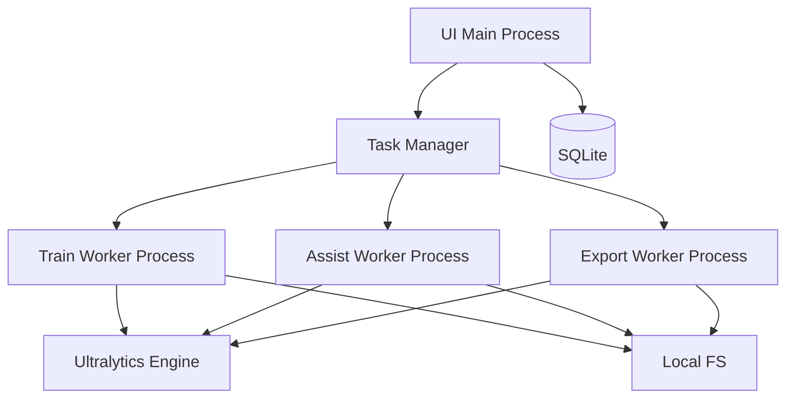

# 标炬（LabelTorch）系统架构

## 架构原则

1. 单机离线优先
2. UI 与训练执行隔离
3. 元数据与大文件分离
4. 版本快照不可变
5. 失败可恢复

## 逻辑分层

1. Presentation Layer（PySide6）
2. Application Layer（Use Case 与编排）
3. Domain Layer（实体与规则）
4. Infrastructure Layer（数据库/文件系统/训练引擎）

## 运行时架构

## 技术栈固定

1. Python 3.11+
2. PySide6
3. Ultralytics 官方接口
4. SQLite
5. ONNX Runtime（验证导出可用性）

## 核心组件

1. Project Manager
2. Dataset Manager
3. Annotation Editor
4. Training Orchestrator
5. Model Registry
6. Export Manager
7. Packaging Runner
